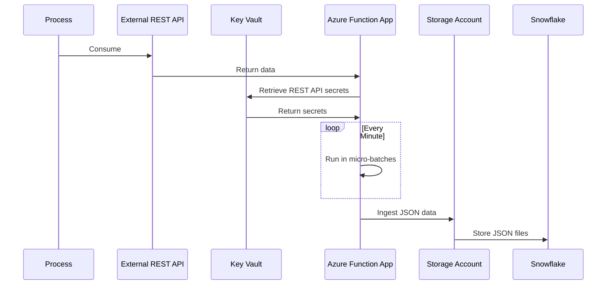
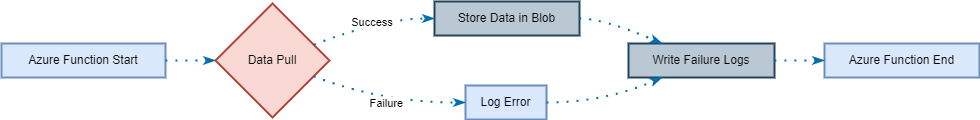
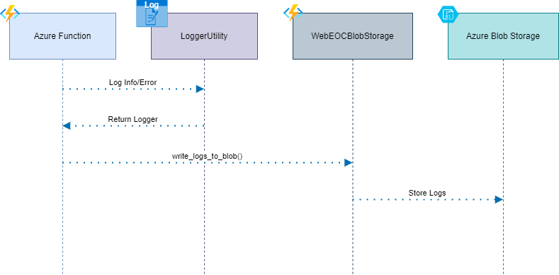
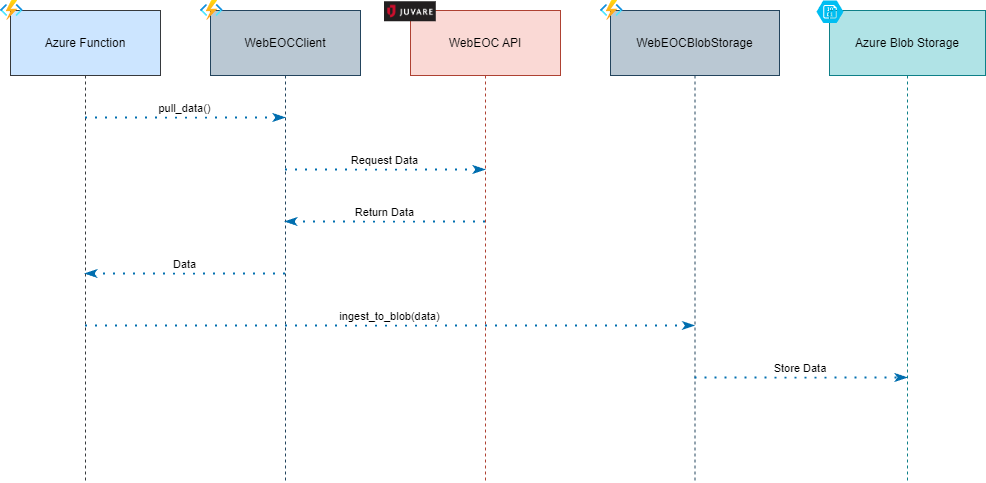
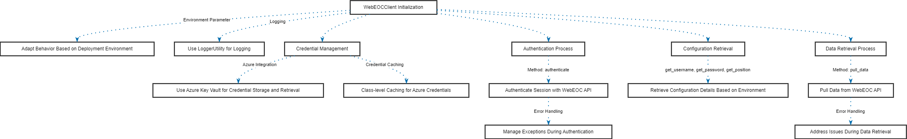
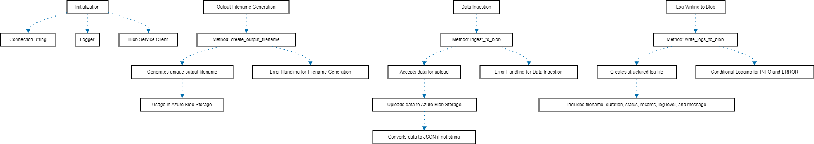
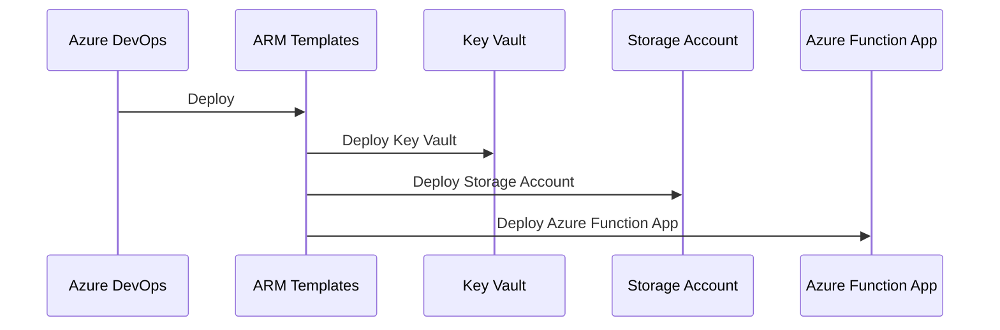

[](https://codecov.io/gh/arturogonzalezm/azure_function)
[](https://github.com/arturogonzalezm/azure_function/blob/master/LICENSE)
[](https://github.com/arturogonzalezm/azure_function/wiki)
[](https://github.com/arturogonzalezm/azure_function/actions/workflows/pylint.yml)
[](https://github.com/arturogonzalezm/azure_function)
[](https://github.com/arturogonzalezm/azure_function)


# Azure Function and Storage Account #

This project is a proof of concept to create an Azure Function App, Key Vault and a Storage Account using ARM Templates.

## SaaS Overview

- The Azure Function App will consume an external REST API 
- THE Azure Function App will retrieve the REST API secrets from the Key Vault.
- The Azure Function App will run in micro-batches every minute.
- The Azure Function App will ingest the JSON data into the Storage Account.
- The JSON files stored in the Storage Account will be stored in Snowflake.



- This project is designed to integrate with Azure Functions and WebEOC API. 
- This project integrates with Azure Functions to interact with WebEOC API and Azure Blob Storage. 
- It includes a logging utility, a client for WebEOC API, and functionalities to store data and logs in Azure Blob Storage. 
- The main application is an Azure Function that periodically pulls data from the WebEOC API, processes it, 
and then stores both the data and associated logs.

## Workflow



### Features
- Custom logging setup compatible with Azure Functions and Application Insights.
- Data pulling from WebEOC API.
- Data and log ingestion to Azure Blob Storage.
- Environment-specific configuration and secret management.

## Installation
Provide instructions on how to set up and install your project. This might include:
- Cloning the repository.
- Setting up a virtual environment.
- Installing dependencies.

```bash
git clone azure_function
cd azure_function
git init
git remote add origin
git pull origin master
```

```bash
python -m venv .venv
.\.venv\Scripts\Activate.ps1
```

```bash
python -m pip install --upgrade pip setuptools wheel
pip install -r requirements.txt
```

## Key Components

```class LoggerUtility```: Provides logging functionalities tailored for Azure Functions.

```configure_logger()```: Configures the logger with default settings suitable for Azure Functions.

```get_logger(name)```: Returns a configured logger instance.



```class WebEOCBlobStorage()```: Manages the storage of data and logs in Azure Blob Storage.

```ingest_to_blob(data, blob_name, container_name)```: Uploads data to Azure Blob Storage.

```write_logs_to_blob(log, blob_name, container_name)```: Uploads logs to Azure Blob Storage.

```create_output_filename(log, blob_name, container_name)```: Generates a filename based on a specified format and current time in Perth time zone.

```class WebEOCClient()```: Client for interacting with the WebEOC API.
    
```pull_data()```: Pulls data from the WebEOC API.



## WebEOCClient Class
The WebEOCClient class is designed to interface with the WebEOC API. It manages authentication and data retrieval specific to a deployment environment. This class uses Azure services for secure credential storage and retrieval, ensuring safe access to the WebEOC API.

### WebEOCClient Key Features
Initialization
- Environment Parameter: The client is initialized with a environment parameter, allowing it to adapt its behavior based on the deployment environment (e.g., production, development, or user acceptance testing).
- Logging: Utilizes the LoggerUtility for logging, aiding in monitoring and debugging.

Credential Management
- Azure Integration: Leverages Azure Key Vault for secure credential storage and retrieval.
- Credential Caching: Utilizes class-level caching for Azure credentials to optimize performance.

Authentication
- Method: authenticate
- Functionality: Authenticates the session with the WebEOC API using credentials specific to the deployment environment.
- Error Handling: Includes comprehensive error handling to manage exceptions during the authentication process.

Configuration Retrieval
- Several methods (get_username, get_password, get_position, etc.) retrieve configuration details like username, password, and position, based on the deployment environment.
- Error Handling: Includes comprehensive error handling to manage exceptions during the configuration retrieval process.

Data Retrieval
- Method: pull_data
- Functionality: Pulls data from the WebEOC API based on the specified board and display names relevant to the deployment environment.
- Error Handling: Robust error handling to address issues during the data retrieval process.

Usage
```python
client = WebEOCClient(environment='uat')
data = client.pull_data()
```



## WebEOCBlobStorage Class

The WebEOCBlobStorage class is designed to handle interactions with Azure Blob Storage within the context of the WebEOC project. It primarily focuses on uploading data and log files to Azure Blob Storage, ensuring that data is stored securely and logs are kept for monitoring and debugging purposes.

### WebEOCBlobStorage Key Features

Initialization
- Connection String: Retrieves the Azure Blob Storage connection string from environment variables.
- Logger: Utilizes LoggerUtility for logging, aiding in tracking the process and handling errors.
- Blob Service Client: Initializes a Blob Service Client with the given connection string.

Output Filename Generation
- Method: create_output_filename
- Functionality: Generates a unique output filename based on the current date and time in the 'Australia/Perth' timezone.
- Usage: This filename is used when uploading data to Azure Blob Storage.
- Error Handling: Includes comprehensive error handling for various scenarios like missing data, blob already exists, container/blob not found, and general Azure storage errors.

Data Ingestion
- Method: ingest_to_blob
- Parameters: Accepts the data to be uploaded.
- Functionality: Uploads the given data to Azure Blob Storage. If the data is not a string, it converts it into JSON format.
- Error Handling: Includes comprehensive error handling for various scenarios like missing data, blob already exists, container/blob not found, and general Azure storage errors.

Log Writing to Blob
- Method: write_logs_to_blob
- Parameters: Start time, end time, duration, status, records pulled, log level, and log message.
- Functionality: Creates a structured log file and uploads it to Azure Blob Storage. The log file includes details such as the filename, process duration, status, number of records pulled, and a log message.
- Conditional Logging: Includes log level and log message only for "INFO" or "ERROR" levels.

Usage
```python
storage = WebEOCBlobStorage()
storage.ingest_to_blob(data)
storage.write_logs_to_blob(start_time, end_time, duration, status, records_pulled, log_level, log_message)
```



## TODO: Azure Resources(IaaS) Overview

- Azure Function App will be deployed by using ARM Templates.
- Key Vault will be deployed by using ARM Templates.
- Storage Account will be deployed by using ARM Templates.
- The ARM Templates will be deployed by using Azure DevOps.



-------------------------------------------------------------------------------------------------------------------
### Author: ###
This project was made by [**Arturo Gonzalez**]